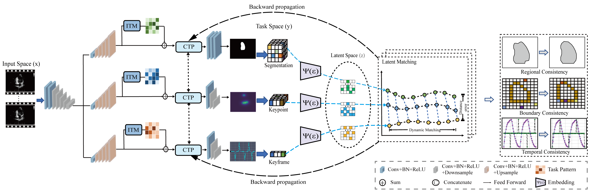

# Embedding Tasks Into the Latent Space: Cross-Space Consistency for Multi-Dimensional Analysis in Echocardiography

Zhenxuan Zhang; Chengjin Yu; Heye Zhang; Zhifan Gao

Multi-dimensional analysis in echocardiography has attracted attention due to its potential for clinical indices quantification and computer-aided diagnosis. It can utilize various information to provide the estimation of multiple cardiac indices. However, it still has the challenge of inter-task conflict. This is owing to regional confusion, global abnormalities, and time-accumulated errors. Task mapping methods have the potential to address inter-task conflict. However, they may overlook the inherent differences between tasks, especially for multi-level tasks (e.g., pixel-level, image-level, and sequence-level tasks). This may lead to inappropriate local and spurious task constraints. We propose cross-space consistency (CSC) to overcome the challenge. The CSC embeds multi-level tasks to the same-level to reduce inherent task differences. This allows multi-level task features to be consistent in a unified latent space. The latent space extracts task-common features and constrains the distance in these features. This constrains the task weight region that satisfies multiple task conditions. Extensive experiments compare the CSC with fifteen state-of-the-art echocardiographic analysis methods on five datasets (10,908 patients). The result shows that the CSC can provide left ventricular (LV) segmentation, (DSC = 0.932), keypoint detection (MAE = 3.06mm), and keyframe identification (accuracy = 0.943). These results demonstrate that our method can provide a multi-dimensional analysis of cardiac function and is robust in large-scale datasets.

## Citation
@ARTICLE{10428074,
  author={Zhang, Zhenxuan and Yu, Chengjin and Zhang, Heye and Gao, Zhifan},
  journal={IEEE Transactions on Medical Imaging}, 
  title={Embedding Tasks Into the Latent Space: Cross-Space Consistency for Multi-Dimensional Analysis in Echocardiography}, 
  year={2024},
  volume={43},
  number={6},
  pages={2215-2228},
  keywords={Task analysis;Feature extraction;Echocardiography;Multitasking;Image segmentation;Cardiac disease;Sensitivity;Multi-task learning;consistency learning;echocardiography;multi-dimensional analysis;latent space},
  doi={10.1109/TMI.2024.3362964}}

